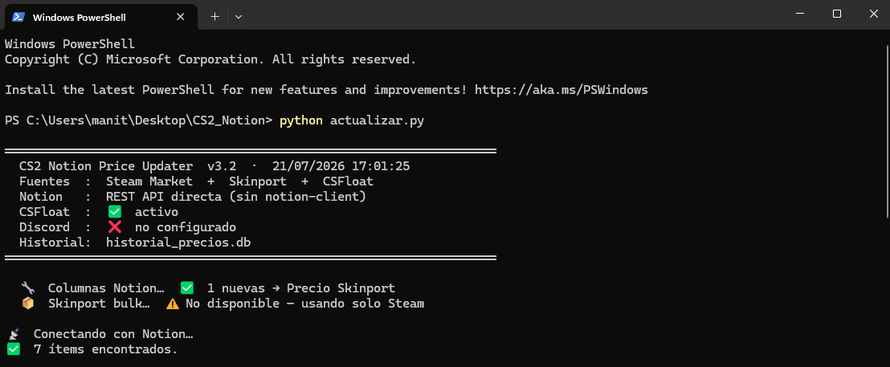
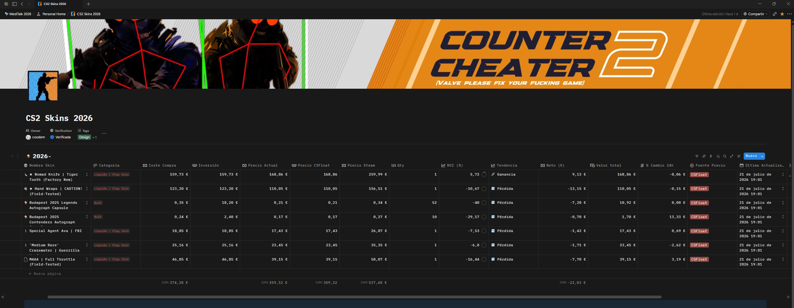
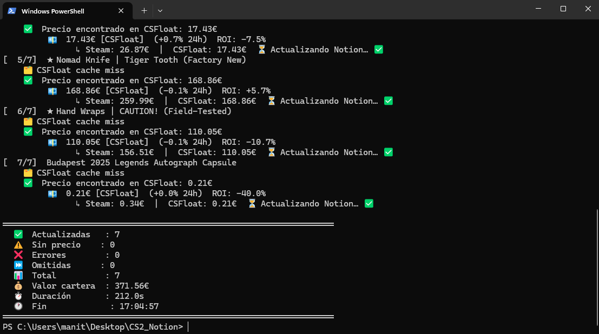

<div align="center">

# 🎯 CS2 Notion Price Updater

### Automatically keep your Counter-Strike 2 skin portfolio up to date in Notion.

[](https://python.org)
[](https://developers.notion.com/)
[](https://steamcommunity.com/market/)
[](https://sqlite.org/)
[](https://discord.com/)
[](LICENSE)

**Steam Market • Skinport • CSFloat • Notion • SQLite • Discord**

</div>

---

## 📸 Preview



### Notion Database



### Console Output



---

# ✨ Features

- 💰 Retrieves prices from **Steam Market**
- 🛒 Retrieves prices from **Skinport**
- 📈 Retrieves prices from **CSFloat**
- 🎯 Automatically selects the **lowest available price**
- 🔄 Updates your **Notion database**
- 🖼 Automatically fetches item images
- 📊 Calculates ROI
- 📈 Tracks 24h price changes
- 💾 Stores complete price history in SQLite
- 🔔 Sends Discord alerts
- ⚡ Automatic retry system and API rate-limit handling
- 🔐 Secure configuration via `.env`

---

# 🏗 Architecture

```text
              Steam Market
                    │
                    │
             Skinport API
                    │
                    │
             CSFloat API
                    │
                    ▼
        Price Aggregator Engine
                    │
        ┌───────────┴───────────┐
        │                       │
        ▼                       ▼
    SQLite History          Discord Alerts
        │
        ▼
      Notion API
```

---

# 📦 Installation

Clone the repository

```bash
git clone https://github.com/yourusername/CS2-Notion-Price-Updater.git
```

Go into the project

```bash
cd CS2-Notion-Price-Updater
```

Install dependencies

```bash
pip install -r requirements.txt
```

Create your environment file

```bash
cp .env.example .env
```

Fill your credentials

```env
NOTION_TOKEN=
NOTION_DATABASE_ID=
DISCORD_WEBHOOK=
CSFLOAT_API_KEY=
```

Run

```bash
python actualizar.py
```

---

# 📂 Project Structure

```text
CS2-Notion-Price-Updater/
│
├── actualizar.py
├── requirements.txt
├── README.md
├── LICENSE
├── .gitignore
├── .env.example
│
├── assets/
│   ├── demo.gif
│   ├── notion-dashboard.png
│   └── console.png
│
└── historial_precios.db
```

---

# ⚙️ Technologies

- Python
- Notion REST API
- Steam Market API
- Skinport API
- CSFloat API
- SQLite
- Discord Webhooks

---

# 📊 What gets updated?

| Field | Updated |
|-------|---------|
| Current Price | ✅ |
| Steam Price | ✅ |
| Skinport Price | ✅ |
| CSFloat Price | ✅ |
| Best Source | ✅ |
| ROI | ✅ |
| 24h Change | ✅ |
| Last Update | ✅ |
| Image | ✅ |

---

# 🔒 Security

This repository **never stores credentials**.

All sensitive information is loaded through environment variables.

```
.env
```

is excluded via `.gitignore`.

---

# 🚀 Roadmap

- [ ] Docker support
- [ ] Automatic scheduling
- [ ] Price charts
- [ ] Telegram notifications
- [ ] Inventory analytics
- [ ] Web dashboard

---

# ⭐ Support

If you like this project, consider giving it a ⭐ on GitHub!

```
